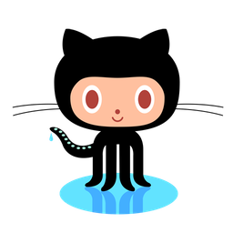

Using GitHub with RStudio
========================================================
author: Paul Manser
date:  3/20/2014

Introduction
========================================================

### Are statisticians programmers?
* We write code  
* We use high-powered computers
* We drink lots of coffee

### Statisticians vs programmers
* What is the end goal?
* How do we write and develop code?
* How do we share our work?  

Open source
========================================================
* Source code made public and free
* Owner maintains rights to study, change, distribute  
* Public collaborative software development
* Personalized versions of public software  
* Take accountability for our own code
* We're probably not going to get rich writing R packages

What are Git and GitHub?
========================================================

### Git
* Revision control system
* Allows for many authors to contribute to one project
* Command line tool with RStudio GUI

### GitHub
* Web-based hosting service for software development
* Uses the Git revision control system
* Publish and maintain R code & packages
* Community of developers

Git
========================================================

### What does Git do?
* Stores "snapshots" of your project as you go
* What, when, why, who?
* Can revert to older versions of project

### Main actions
* Modify code file(s)
* Stage changes
* Commit 

[Try Git at Code School](http://try.github.io/levels/1/challenges/1)

GitHub
========================================================

### What does it add on top of Git?
* Common public repository to share code online   
    - R Users Group
* Publish packages outside of Bioconductor/CRAN
* Another way to back up your R files
* Programming resume

### Main actions
* Push
* Pull
* Fork

Putting it all together
========================================================
left: 80%
### Create a gist
* Write a function and save as gist
* Source using devtools package

### Create a GitHub repository
* Write a cool new function
* Push to GitHub
* Modify R script
* Commit & push new version  

### Fork a repository

***

